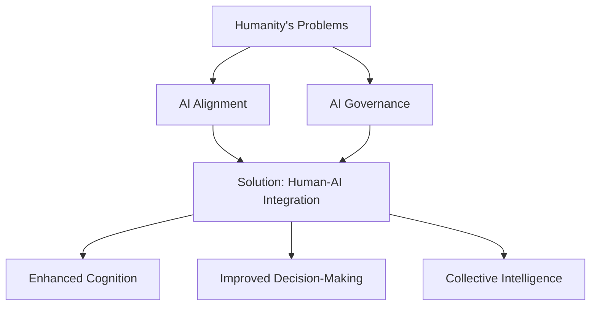

---

# Project: "Synergy Core" - Deep AI-Human Integration

**Mission:** To develop a profoundly integrated AI-human system where the AI becomes an extension of the individual, constantly learning from and with them. The ultimate aim is to enhance human capabilities, foster self-understanding, and contribute to solving complex global challenges, including AI alignment and governance, by making humans "AI-native."

**Core Philosophy:** The primary limitation of current AI isn't (just) intelligence or understanding, but a lack of continuous, rich, and personalized input from the individual it's meant to serve. This system aims to bridge that gap.

## I. The "Why": Addressing Fundamental Problems

1.  **AI Alignment:** If an AI is deeply intertwined with an individual's values, experiences, and goals (because it's built *from* them), its alignment with that individual becomes inherent. Scaled, this could inform broader AI alignment.
2.  **AI Governance:** A populace that is AI-literate and deeply integrated with personalized AIs is better equipped to participate in and shape AI governance frameworks. Control becomes more distributed and personalized.
3.  **Human Flourishing & Augmentation:**
    *   **Enhanced Self-Awareness:** An AI that "understands you better than you understand yourself" can provide novel insights, highlight blind spots, and reveal patterns in your thoughts, emotions, and behaviors.
    *   **Accelerated Learning (IQ/EQ):** A personalized AI tutor/mentor can adapt to your learning style, identify knowledge gaps, and provide tailored challenges and information to boost cognitive and emotional intelligence.
    *   **Problem Solving:** Augmented individuals, equipped with personalized AI co-pilots, can contribute more effectively to solving humanity's biggest issues (climate change, global risks, etc.).

## II. System Architecture: The "Synergy Loop"

The system is envisioned as a continuous loop of information flow and co-creation between the human and the AI.

### A. Input Layer: "The Sensorium"
*Goal: To capture a comprehensive, continuous stream of the user's experiences and interactions.*
*   **Digital Interactions (Primary Focus):**
    *   **Text:** All typed input (emails, messages, documents, notes, code).
    *   **Audio:** Voice commands, conversations (with explicit consent and privacy controls), ambient sound analysis (e.g., for focus levels).
    *   **Visual:** Screen recordings (what you see and interact with on devices), videos you create/watch (with analysis of content and your reactions if available).
    *   **Browsing History & App Usage:** Understanding information consumption and digital behavior patterns.
*   **Biometric Data (Future/Optional with Wearables):**
    *   Heart rate, sleep patterns, activity levels, stress indicators (e.g., HRV).
*   **Environmental Data (Future/Optional):**
    *   Location, calendar events, ambient conditions (light, noise).
*   **Explicit User Input:**
    *   Journaling, mood tracking, goal setting, direct feedback to the AI.
    *   Answers to AI-posed questions.

### B. Processing & Co-Creation Layer: "The AI Symbiont"
*Goal: To process raw input, learn patterns, and collaborate with the user to build understanding.*
*   **AI Core Technologies:**
    *   **Natural Language Processing (NLP/NLU/NLG):** For understanding and generating text/speech.
    *   **Machine Learning (ML):** Pattern recognition, predictive modeling, anomaly detection.
    *   **Knowledge Graph Construction:** Building a structured, interconnected model of the user's information.
    *   **Reinforcement Learning from Human Feedback (RLHF) / Direct Preference Optimization (DPO):** AI learns directly from user corrections, preferences, and guidance.
*   **Key Processes:**
    *   **Continuous Ingestion & Indexing:** Raw data is constantly fed into the system.
    *   **Contextualization Engine:** The AI strives to understand the "why" behind the "what." (Addresses the "assembling context" challenge).
    *   **Pattern Recognition & Insight Generation:** Identifying habits, preferences, emotional states, knowledge gaps, areas of interest.
    *   **Interactive Refinement:** The AI asks clarifying questions, presents tentative conclusions for user validation. The user actively teaches the AI.

### C. Personal Information Management (PIM): "The Blueprint"
*Goal: A dynamic, evolving, AI-curated and user-verified knowledge base representing the individual.*
*   **Content:**
    *   Key memories, insights, skills, values, beliefs, goals.
    *   Summaries of important information encountered.
    *   Models of the user's cognitive and emotional patterns.
    *   User-defined schemas and desired output formats.
*   **Structure:**
    *   Likely a multi-modal knowledge graph.
    *   Temporal (how things change over time).
    *   Semantic (how concepts relate).
*   **Generation & Maintenance:**
    *   AI proposes entries and structures.
    *   User validates, edits, adds, and curates.
    *   AI suggests optimal organization formats, or uses user-defined ones.

### D. Output & Interaction Layer: "The Augmentation Interface"
*Goal: To provide value back to the user in seamless, intuitive, and empowering ways.*
*   **Conversational Interface:**
    *   AI engages in proactive dialogue (e.g., "I noticed you're researching X, here are some related concepts you explored last month").
    *   User can query their "Blueprint" (e.g., "What were my main concerns about project Y?").
*   **Personalized Summaries & Reports:**
    *   "Daily Digest" of your information landscape.
    *   "Weekly Reflection" on emotional trends or progress towards goals.
    *   Information synthesized in user-specified formats.
*   **Proactive Assistance & Nudges:**
    *   Reminders based on learned patterns (e.g., "You tend to be most productive on creative tasks in the morning").
    *   Suggestions for learning resources or new perspectives.
*   **Skill Development Modules:**
    *   AI-guided exercises to improve IQ (e.g., problem-solving, critical thinking) and EQ (e.g., empathy, self-regulation).
*   **Creative Co-Pilot:**
    *   Assistance in brainstorming, writing, problem-solving.

## III. Main Challenges & Considerations

1.  **Data Input, Recollection, and Processing:**
    *   **Volume & Velocity:** Constant data stream requires significant storage and processing power.
    *   **Signal vs. Noise:** Differentiating relevant information from trivial data.
    *   **Multi-Modal Integration:** Effectively combining and understanding data from diverse sources (text, audio, video, biometrics).
2.  **Assembling the Right Context ("Context without Proper Context"):**
    *   The AI needs to infer context initially and learn to ask the right questions to build richer context over time. This is an iterative bootstrapping problem.
3.  **Privacy & Security (Paramount):**
    *   **Data Ownership & Control:** User must have absolute control and ownership of their data.
    *   **Encryption & Anonymization:** Robust security measures are non-negotiable.
    *   **Transparency & Explainability:** Users need to understand how the AI is learning and why it makes certain suggestions.
4.  **User Trust & Adoption:**
    *   Overcoming the "creepy" factor.
    *   Demonstrating tangible benefits quickly.
    *   Ensuring the AI feels like an empowering tool, not an overseer.
5.  **Ethical Boundaries & Autonomy:**
    *   Avoiding over-reliance or diminishment of user agency.
    *   Preventing the AI from creating filter bubbles or reinforcing biases.
    *   Defining what "better than you" means and ensuring it aligns with user well-being, not just optimization metrics.
6.  **The "Blueprint" Accuracy & Utility:**
    *   Ensuring the PIM is an accurate and useful representation, not a distorted or oversimplified one.
    *   Allowing for evolution and change in the user.

## IV. Potential Impact & "Star Reaching" Goals

*   **Individual Level:** Radically enhanced self-awareness, personalized learning, improved decision-making, amplified creativity and productivity.
*   **Societal Level:**
    *   A more AI-literate and engaged populace.
    *   Potential for novel solutions to global challenges through augmented human intelligence.
    *   A pathway to inherent AI alignment by grounding AI in individual human experience.
    *   A model for decentralized, personalized AI governance.

## V. Next Steps (Conceptual)

1.  **Proof of Concept (PoC) - Single Modality:** Start with a single, rich input source (e.g., all text communications or a dedicated journaling app with AI interaction).
2.  **Develop Core PIM Structure:** Design the initial framework for the "Blueprint."
3.  **Iterative Feedback Loop:** Focus on the AI's ability to ask clarifying questions and the user's ability to teach the AI.
4.  **Prioritize Privacy & User Control:** Build these principles in from day one.

